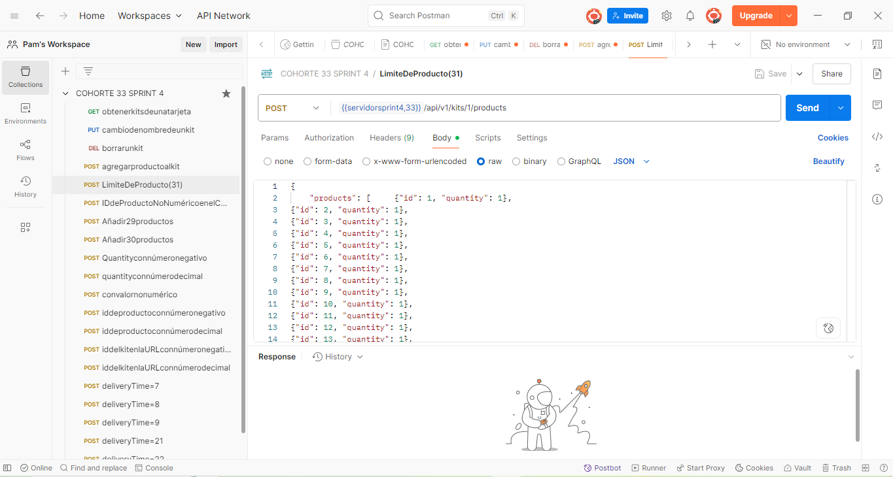
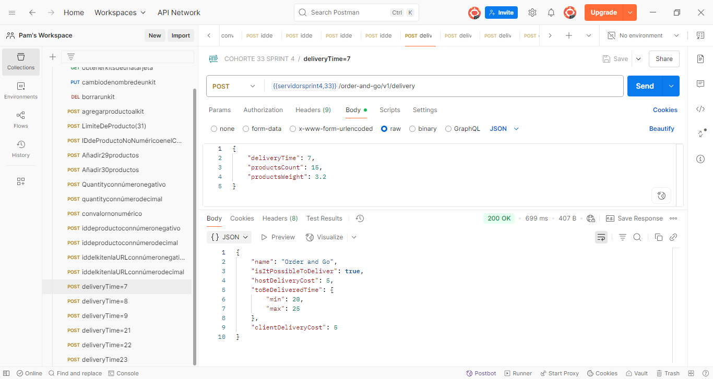

# 🧪 API Testing con Postman – Proyecto TripleTen

Este repositorio contiene una colección de pruebas API desarrolladas con **Postman** como parte del programa **QA Engineer de TripleTen**.

---

## 📂 Contenido del Repositorio

- `API-test-TripleTen.postman_collection.json`: colección exportada de Postman con pruebas HTTP, variables y validaciones.
- `README.md`: descripción del proyecto y guía de uso.
- 📸 Carpeta `screenshots/` con capturas de la colección funcionando.
---

### 📸 Vista previa en Postman

#### ✅ Colección importada

#### ✅ Solicitud ejecutada con éxito

<!--
Si en el futuro haces la captura de tests, puedes añadir esta línea:
#### ✅ Resultado de test

-->

---

## 🚀 ¿Cómo usar este proyecto?

### 🔁 Importar la colección en Postman

1. Abre **Postman** en tu computadora.
2. Haz clic en **“Import”** (parte superior izquierda).
3. Selecciona el archivo:
4. ¡Listo! Ya puedes ver y ejecutar las solicitudes (requests) incluidas.

---

## ✅ Casos de Prueba Cubiertos

- Validación de endpoints con respuestas esperadas
- Verificación de códigos de estado (`200 OK`, `404 Not Found`, etc.)
- Pruebas básicas de validación con `tests` escritos en JavaScript
- Uso de variables de entorno (si aplica)

---

## 🛠 Herramientas utilizadas

- [Postman](https://www.postman.com/) – para el diseño y ejecución de pruebas API
- [Git](https://git-scm.com/) + [GitHub](https://github.com/) – para control de versiones y publicación del proyecto

---

## 👩‍💻 Sobre mí

Soy **Lidia Pamela Rodríguez Vigueras**, QA Engineer con formación técnica en pruebas funcionales y no funcionales. He trabajado con herramientas como:

- Postman
- SQL
- Android Studio
- Selenium
- PyCharm
- Cypress  
y más…

> 💼 Conoce más sobre mi perfil profesional en [LinkedIn](https://www.linkedin.com/in/lidiapamelarodriguezvigueras/)

---

## 📬 Contacto

📧 lidiapamelavidalaboral@gmail.com  
🌎 Mérida, Yucatán, México

---

## 🌟 Gracias por visitar este repositorio

Si deseas colaborar o darme feedback, ¡estoy abierta a aprender y mejorar continuamente!

